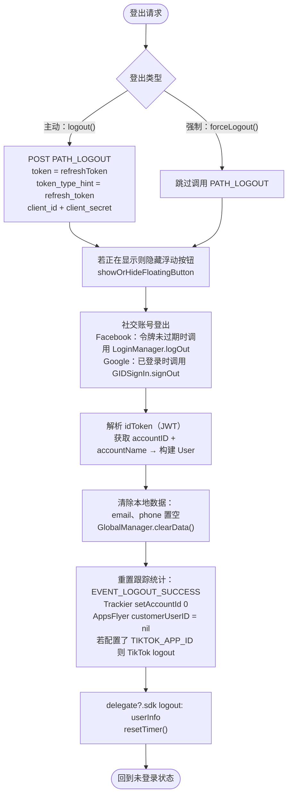

# 登出流程 – iTapSdk (sdk-game-ios-v3)

本文档描述 SDK 的登出流程，基于 `Sdk+Authentication.swift` 中的实际代码整理而成。有**两个函数**：

- **`logout()`** – 主动登出（用户点击登出）。会调用 `PATH_LOGOUT` 接口
  以在服务器端撤销 refresh token。
- **`forceLogout()`** – 因会话失效而被强制登出（错误码 `1001 / 85 / 98`，
  或 `1008` – 会话过期）。**不**调用 `PATH_LOGOUT` 接口，只清理本地数据。

两者都会将用户带回未登录状态并触发 delegate `logout`。

## 登出调用入口

`logout()` 通常从以下地方调用：
- `PersonalView` → `showSignOut()`（确认对话框）→ `doSignOut()` → `Sdk.logout()`。
- `CheckLoginView` → 需要登出时调用 `doSignOut()`。
- 会话过期时（`code = 1008`），在 `doRefreshToken` / `getUserInfo` 中 → 显示提示 → `logout()`。

`forceLogout()` 在刷新令牌返回 `code = 1001 / 85 / 98`（账户被
封禁 / 会话在其他地方被撤销）时调用。

## 总体流程图

## 详细说明

### `logout()` 与 `forceLogout()` 的区别

**唯一的业务差异**：`logout()` 调用 `PATH_LOGOUT` 接口（POST）在服务端撤销
`refreshToken`（发出即忘），而 `forceLogout()` 跳过此步骤，因为
会话在服务端已经失效。其余清理步骤相同。

`PATH_LOGOUT` 的请求体：
`token = refreshToken`、`token_type_hint = "refresh_token"`、`client_id`、`client_secret`；
请求头使用 `ServiceProcessor.createHeaderFieldType1()`。

### 公共清理步骤

1. **隐藏浮动按钮（floating button）** – 若正在显示则调用 `showOrHideFloatingButton()`。
2. **社交账号登出**：
   - Facebook：若 `AccessToken.current` 未过期 → 调用 `LoginManager().logOut()`。
   - Google：若 `GIDSignIn.hasPreviousSignIn()` → 调用 `GIDSignIn.sharedInstance.signOut()`。
3. **构建返回的用户信息** – 解析 `idToken`（JWT），从 payload 中提取 `accountID` 和
   `accountName` 以构建 `User` 对象（供 delegate 使用）。
4. **清除本地数据** – 将 `email`、`phone` 置空，并调用 `GlobalManager.shared.clearData()`
   （清除令牌和登录状态）。
5. **重置跟踪统计/analytics**：
   - 发送 `EVENT_LOGOUT_SUCCESS` 事件。
   - `TrackierSdk.setAccountId(0, withAccountName: "")`。
   - `AppsFlyerLib.shared().customerUserID = nil`。
   - 若配置了 `TIKTOK_APP_ID` 则调用 `TikTokBusiness.logout()`。
6. **通知 app 并重置计时器**：
   - 调用 delegate `delegate?.sdk?(self, logout: userInfo)` 以通知 app 已登出。
   - `resetTimer()` 停止会话计时器。

以上步骤完成后，SDK 处于未登录状态；下次调用 `Sdk.login()` 会再次显示
登录屏幕。

## 使用的接口

- `PATH_LOGOUT` – 在服务端撤销 refresh token（POST，仅在 `logout()` 中使用）

## 备注

- `forceLogout()` 使用 `getAccountNameInPayloadV2` 获取账户名（与 `logout()`
  使用 `getAccountNameInPayload` 不同），但清理和 delegate 部分是相同的。
- 调用 `PATH_LOGOUT` 是发出即忘：SDK 不等待服务器返回结果，而是立即清理本地
  数据，确保用户在客户端始终能够成功登出。
- 登出始终会携带 `User`（accountID、accountName）触发 delegate `logout`，以便 app 同步
  状态并处理对应的 UI。
