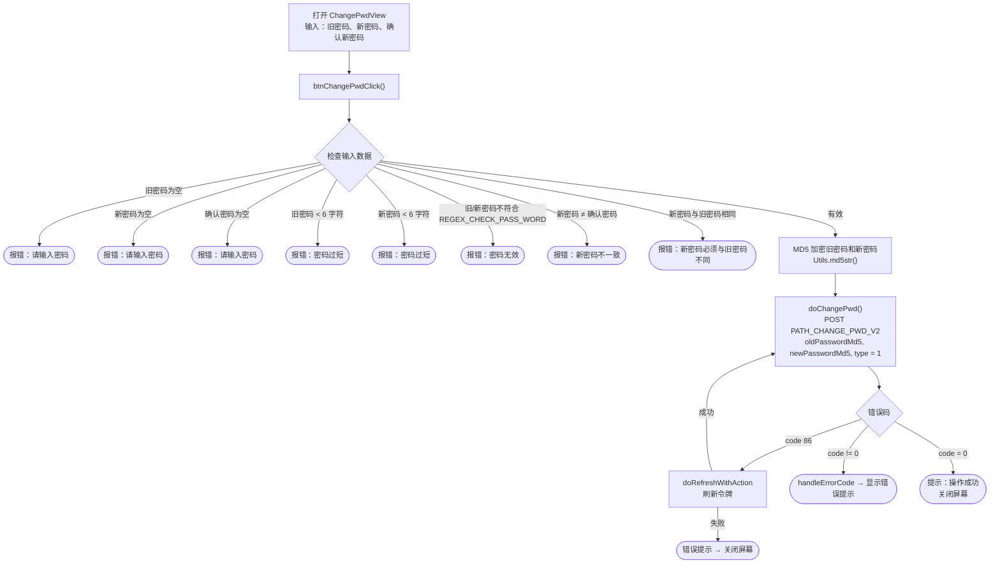

# 修改密码流程 – iTapSdk (sdk-game-ios-v3)

本文档描述 SDK 在用户**已登录**状态下的修改密码流程，基于
实际代码整理而成：`ChangePwdView.swift`（标题为 *"修改密码"*）。

> 区分说明：这是**修改密码**（知道旧密码，处于登录状态）——不同于
> **忘记密码**（通过邮箱/手机号 OTP 找回）。

## 总体流程图

## 详细说明

### 1. 输入与检查数据 – `btnChangePwdClick()`

屏幕包含 3 个输入框：**旧密码**（`txtPwd`）、**新密码**（`txtNewPwd`）、
**确认新密码**（`txtConfirmNewPwd`）。点击"修改密码"时，SDK 依次检查
（遇到错误则将相应输入框标红并停止）：

- 旧密码、新密码、确认密码都不能为空。
- 旧密码和新密码至少 6 个字符。
- 旧密码和新密码必须符合 `REGEX_CHECK_PASS_WORD`。
- 新密码和确认密码必须一致。
- 新密码必须与旧密码不同。

### 2. 加密并调用接口 – `doChangePwd()`

有效则 → 旧密码和新密码在发送前会被**进行 MD5 哈希**（`Utils.md5str`）。调用
`PATH_CHANGE_PWD_V2`（POST），参数为 `oldPasswordMd5`、`newPasswordMd5`、`type = 1`
（附带 `deviceId`、`os`、`osVersion`、`ip`），请求头携带 Bearer accessToken。

- `code = 0`：显示提示"操作成功" → 关闭屏幕。
- `code = 86`（令牌过期）：`doRefreshWithAction` 刷新令牌；成功则
  **自动重新调用** `doChangePwd()`，失败则显示错误提示后关闭屏幕。
- 其他错误：`handleErrorCode` 显示错误提示。

## 使用的接口

- `PATH_CHANGE_PWD_V2` – 在登录状态下修改密码（POST，`type = 1`）

## 备注

- 密码**不以明文发送**：旧密码和新密码在客户端都会经过 MD5 哈希处理
  （`oldPasswordMd5`、`newPasswordMd5`）后再发送到服务器。
- 整个操作都需要 `accessToken`（Bearer）。遇到 `code = 86` 时，SDK 会自动刷新令牌
  后重复执行当前未完成的修改密码请求。
- 修改密码成功后**不会要求重新登录**——此屏幕只会显示成功提示并关闭。
