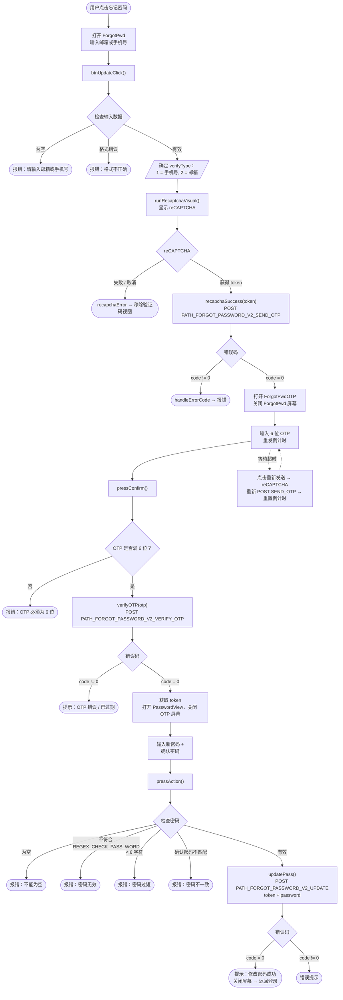

# 忘记密码流程 – iTapSdk (sdk-game-ios-v3)

本文档描述 SDK 的密码找回/重置流程，基于实际代码整理而成：
`ForgotPwd.swift`（输入邮箱/手机号）→ `ForgotPwdOTP.swift`（验证 OTP）→
`PasswordView.swift`（设置新密码）。

## 总体流程图

## 详细说明

### 步骤 1 – 输入邮箱/手机号（`ForgotPwd`）

用户输入邮箱或手机号。`btnUpdateClick()` 检查：

- 不能为空。
- 通过 `isValidPhoneOrEmail()` 检查格式是否正确：
  - 符合 `REGEX_PHONE`（越南手机号）→ `verifyType = 1`。
  - 符合邮箱正则 → `verifyType = 2`。
  - 两者都不符合 → 报格式错误。

有效则 → 调用 `runRecaptchaVisual()` 显示 reCAPTCHA。获得 token 后，
`recapchaSuccess()` 调用 `PATH_FORGOT_PASSWORD_V2_SEND_OTP`（POST），参数为
`reCaptChaVer`、`reCaptChaToken`、`verifyInfo`、`clientId`、`deviceId`、`os`、`osVersion`、`ip`。

- `code = 0`：打开 `ForgotPwdOTP` 屏幕（传入 `verifyInfo`、`verifyType`）并关闭当前屏幕。
- `code != 0`：`handleErrorCode(99)` 显示错误提示。

### 步骤 2 – 验证 OTP（`ForgotPwdOTP`）

屏幕显示 6 位 OTP 输入框和重发倒计时（`Constants.timeOutOtpAgain`）。

点击确认时，`pressConfirm()` 检查 OTP 是否满 6 位；若满则调用 `verifyOTP()`
→ `PATH_FORGOT_PASSWORD_V2_VERIFY_OTP`（POST），参数为 `verifyInfo`、`otp`、`clientId`、`deviceId` 等。

- `code = 0`：从响应中获取 `token`（`ForgotPwdOTPJsonWrapper`），打开 `PasswordView`
  （传入 `token`）并关闭 OTP 屏幕。
- `code != 0`：显示提示（OTP 错误或已过期）。

**重新发送验证码：** 倒计时归零后，标签变为"重新发送验证码"。点击后会重新运行
reCAPTCHA，再次调用 `PATH_FORGOT_PASSWORD_V2_SEND_OTP`；成功则重启
倒计时，失败则显示错误。

### 步骤 3 – 设置新密码（`PasswordView`）

用户输入新密码和确认密码。`pressAction()` 检查：

- 不能为空。
- 符合 `REGEX_CHECK_PASS_WORD`。
- 至少 6 个字符。
- 确认密码必须一致。

有效则 → `updatePass()` 调用 `PATH_FORGOT_PASSWORD_V2_UPDATE`（POST），参数为
`token`（来自 OTP 步骤）、`password`、`clientId`、`deviceId`、`os`、`osVersion`、`ip`。

- `code = 0`：提示"修改密码成功" → 关闭屏幕，用户返回登录界面使用新密码重新登录。
- `code != 0`：显示错误提示。

## 使用的接口

- `PATH_FORGOT_PASSWORD_V2_SEND_OTP` – 发送 OTP 到邮箱/手机号（POST，含 reCAPTCHA）
- `PATH_FORGOT_PASSWORD_V2_VERIFY_OTP` – 验证 OTP，返回 `token`（POST）
- `PATH_FORGOT_PASSWORD_V2_UPDATE` – 使用 `token` 设置新密码（POST）

## 备注

- 每次发送 OTP（无论首次还是重发）都必须经过 reCAPTCHA 验证。
- 验证 OTP 后获得的 `token` 是最后一步能够修改密码的凭证；
  没有有效的 OTP 就无法获得该 token。
- 修改密码成功后，流程**不会自动登录**，而是将用户带回
  登录界面，使用新密码重新登录。
