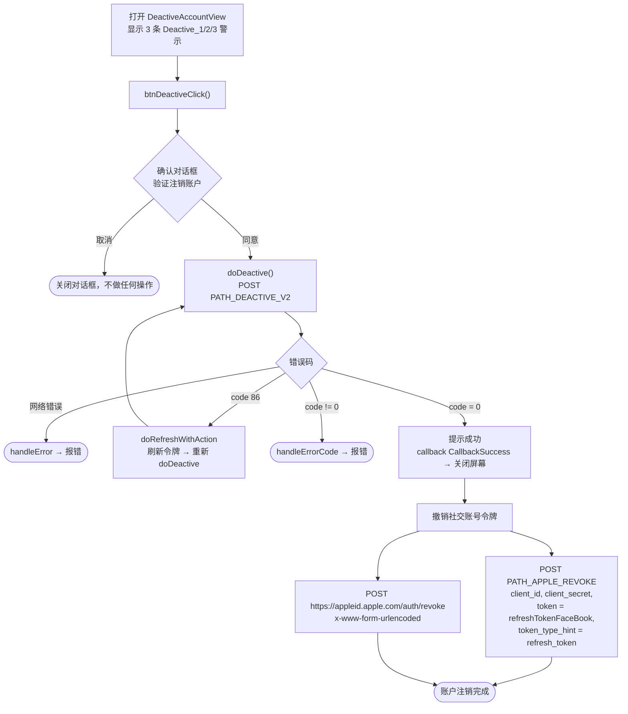

# 账户注销流程 – iTapSdk (sdk-game-ios-v3)

本文档描述 SDK 的账户注销（禁用）流程，基于实际代码整理而成：
`DeactiveAccountView.swift`。

## 总体流程图

## 详细说明

### 1. 警示与确认屏幕

`DeactiveAccountView` 显示 3 行警示文字（`Deactive_1`、`Deactive_2`、`Deactive_3`），
说明注销账户的后果。点击注销按钮时，`btnDeactiveClick()` 会打开
双按钮确认对话框（"验证注销账户"）：

- **取消**：关闭对话框，不执行任何操作。
- **同意**：调用 `doDeactive()`。

### 2. 调用账户注销接口 – `doDeactive()`

调用 `PATH_DEACTIVE_V2`（POST），参数为 `deviceId`、`os`、`osVersion`、`ip`，请求头携带 Bearer
accessToken。

- `code = 0`：显示提示（使用服务器返回的 `message`，默认为"更新成功"），
  触发 `callback(CallbackSuccess)` 后关闭屏幕。随后执行**撤销社交
  账号令牌**（见第 3 节）。
- `code = 86`（令牌过期）：`doRefreshWithAction` 刷新令牌后**自动重新调用** `doDeactive()`。
- 其他错误：`handleErrorCode` 显示错误提示。
- 网络错误：`handleError`。

### 3. 撤销 Facebook / Apple 令牌

账户注销成功后，SDK 立即通过以下两次调用撤销已保存的社交
refresh token（`GlobalManager.shared.refreshTokenFaceBook`）：

1. `PATH_APPLE_REVOKE`（POST，通过 `appleApiService`），参数为 `client_id`、`client_secret`、
   `token = refreshTokenFaceBook`、`token_type_hint = "refresh_token"`。
2. 直接调用 `https://appleid.apple.com/auth/revoke`（POST，
   `application/x-www-form-urlencoded`），参数为 `client_id`、`client_secret`、`token`、
   `token_type_hint = "KeyRefreshToken"`。

两者都是发出即忘（不阻塞主流程）。

## 使用的接口

- `PATH_DEACTIVE_V2` – 注销/禁用账户（POST，携带 Bearer accessToken）
- `PATH_APPLE_REVOKE` – 在后端撤销社交 refresh token（POST）
- `https://appleid.apple.com/auth/revoke` – 直接向 Apple 撤销令牌（POST）

## 备注

- 注销账户有**强制确认步骤**（双按钮对话框）才能调用接口。
- 成功后，除了注销账户外还会撤销社交账号令牌，以确保
  不再存在任何社交登录会话。
- 遇到 `code = 86` 时，SDK 会自动刷新令牌后重复执行当前未完成的注销操作。
- 此屏幕通常从设置/账户信息部分打开（例如 `PersonalView`）。
